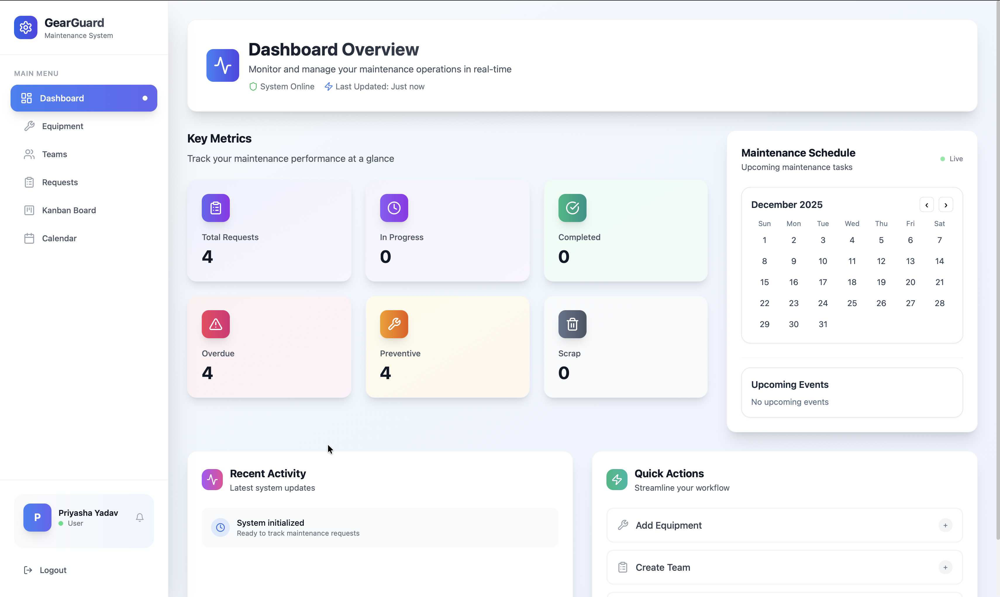
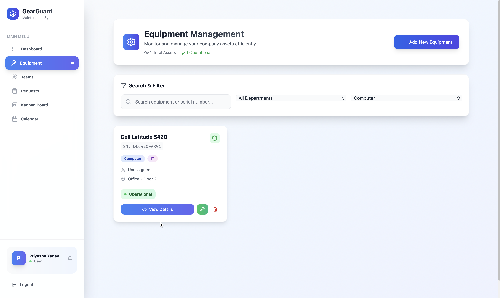
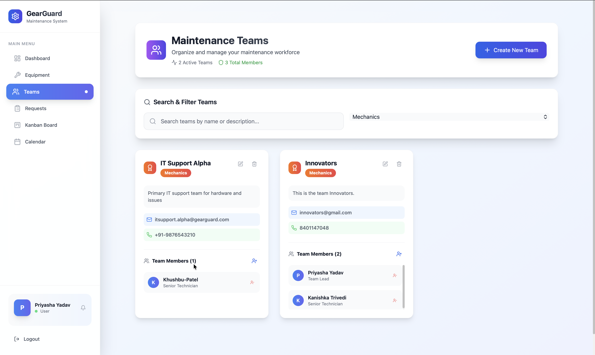
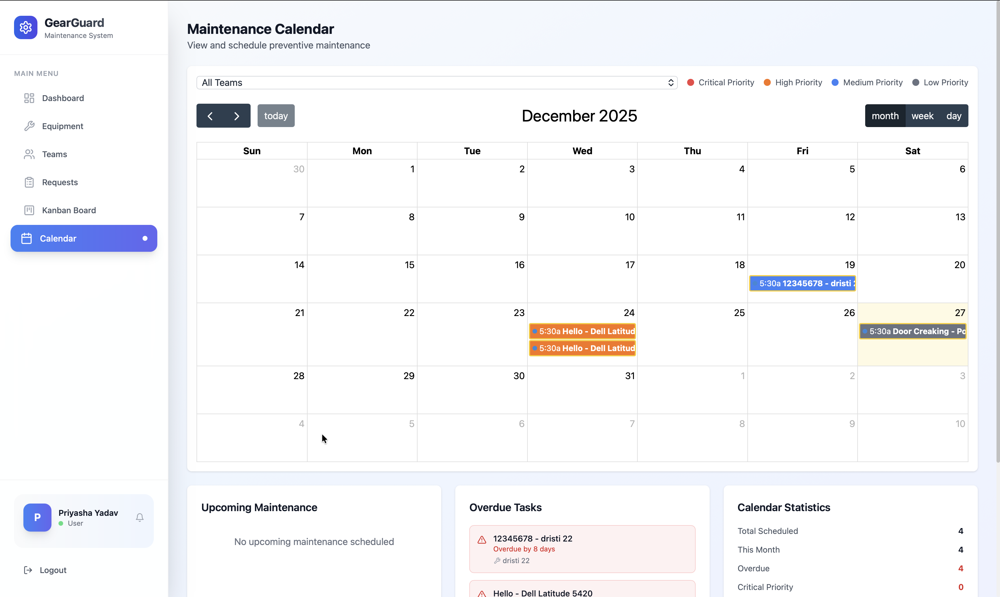

# GearGuard - The Ultimate Maintenance Tracker (Odoo x Adani University Hackathon '26)

A comprehensive MERN stack maintenance management system that helps companies track their assets (machines, vehicles, computers) and manage maintenance requests efficiently.

## Features






### Core Functionality
- **Equipment Management**: Track all company assets with detailed information
- **Maintenance Teams**: Create and manage specialized maintenance teams
- **Maintenance Requests**: Handle both corrective (breakdown) and preventive (routine) maintenance
- **Workflow Management**: Complete lifecycle from request creation to completion

### Key Features
- **Kanban Board**: Drag-and-drop interface for managing request stages
- **Calendar View**: Schedule and view preventive maintenance
- **Smart Buttons**: Quick access to equipment maintenance with badge counts
- **Real-time Notifications**: Overdue task alerts and status updates
- **Role-based Access**: Admin, Manager, Technician, and User roles
- **Search & Filtering**: Advanced filtering by department, team, priority, etc.

### Business Logic
- **Auto-fill Logic**: When selecting equipment, system automatically fetches category and maintenance team
- **Workflow Stages**: New → In Progress → Repaired/Scrap
- **Assignment Logic**: Only team members can pick up requests assigned to their team
- **Overdue Detection**: Automatic highlighting of overdue preventive maintenance

## Tech Stack

### Backend
- **Node.js** with Express.js
- **MongoDB** with Mongoose ODM
- **JWT** for authentication
- **bcryptjs** for password hashing

### Frontend
- **React**
- **Tailwind CSS** for styling
- **Lucide React** for icons
- **React Beautiful DND** for drag-and-drop
- **FullCalendar** for calendar view
- **Axios** for API calls

## Installation

### Prerequisites
- Node.js (v18 or higher)
- MongoDB (running locally or MongoDB Atlas)
- npm or yarn

### Backend Setup

1. Navigate to backend directory:
```bash
cd backend
```

2. Install dependencies:
```bash
npm install
```

3. Create `.env` file:
```env
PORT=5000
MONGODB_URI=mongodb://localhost:27017/gearguard
JWT_SECRET=your_jwt_secret_key_here
NODE_ENV=development
```

4. Start the server:
```bash
npm run dev
```

### Frontend Setup

1. Navigate to frontend directory:
```bash
cd frontend
```

2. Install dependencies:
```bash
npm install
```

3. Create `.env` file:
```env
VITE_API_URL=http://localhost:5000/api
```

4. Start the development server:
```bash
npm run dev
```

## Usage

### Initial Setup
1. Register an admin account
2. Create maintenance teams (Mechanics, Electricians, IT Support, etc.)
3. Add team members to respective teams
4. Register equipment and assign to teams
5. Start creating maintenance requests

### Workflow
1. **Breakdown (Corrective)**:
   - User creates request → System auto-fills equipment details
   - Manager/Technician assigns themselves
   - Stage moves to In Progress
   - Technician records time spent and marks as Repaired

2. **Routine Checkup (Preventive)**:
   - Manager creates preventive request with scheduled date
   - Appears on Calendar View on scheduled date
   - Technician can see and complete the task

### Kanban Board
- Drag cards between stages: New → In Progress → Repaired/Scrap
- Visual indicators for overdue tasks (red border)
- Shows technician avatars and priority levels

### Smart Features
- Equipment pages show "Maintenance" button with open request count
- Real-time notifications for overdue tasks
- Automatic status tracking and duration calculation

## API Endpoints

### Authentication
- `POST /api/auth/login` - User login
- `POST /api/auth/register` - User registration
- `GET /api/auth/users` - Get all users

### Equipment
- `GET /api/equipment` - Get all equipment
- `POST /api/equipment` - Create equipment
- `GET /api/equipment/:id` - Get equipment details
- `PUT /api/equipment/:id` - Update equipment
- `DELETE /api/equipment/:id` - Delete equipment
- `GET /api/equipment/:id/maintenance` - Get equipment maintenance history

### Maintenance Teams
- `GET /api/maintenance-teams` - Get all teams
- `POST /api/maintenance-teams` - Create team
- `POST /api/maintenance-teams/:id/members` - Add team member
- `DELETE /api/maintenance-teams/:id/members/:userId` - Remove member

### Maintenance Requests
- `GET /api/maintenance-requests` - Get all requests
- `POST /api/maintenance-requests` - Create request
- `PATCH /api/maintenance-requests/:id/stage` - Update stage
- `GET /api/maintenance-requests/kanban` - Get kanban data
- `GET /api/maintenance-requests/calendar` - Get calendar data

## Database Schema

### User
- name, email, password, role, department, isActive

### Equipment
- name, serialNumber, category, department, assignedTo, maintenanceTeam, location, status

### MaintenanceTeam
- name, specialization, members, contact info

### MaintenanceRequest
- subject, description, type, priority, equipment, assignedTeam, stage, scheduledDate, duration

## Contributing

1. Fork the repository
2. Create a feature branch
3. Make your changes
4. Add tests if applicable
5. Submit a pull request

## License

This project is licensed under the MIT License.

## Support

For support and questions, please open an issue in the GitHub repository.
